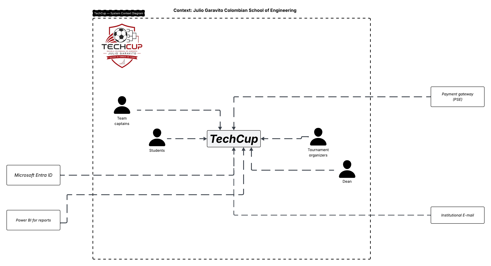

# 📄 Requerimientos del Sistema

## 1. Sistema

* Nombre del sistema: **TechCup**
* Objetivo: El objetivo del sistema es **garantizar que los torneos y las inscripciones cumplan con reglas específicas**, al tiempo que permite a los usuarios interactuar con la plataforma de forma sencilla y segura.

## 2. Problema a resolver
Actualmente, la Escuela Colombiana de Ingeniería Julio Garavito no cuenta con un sistema centralizado para gestionar de manera sencilla y segura los torneos de fútbol semestrales de los programas de Ingeniería de Sistemas, Ingeniería de Inteligencia Artificial, Ingeniería de Ciberseguridad e Ingeniería Estadística.

Esta situación dificulta la gestión de los torneos y el proceso de inscripción de los equipos, incluyendo el registro de equipos, el procesamiento y validación de los pagos, la consulta de los equipos inscritos y la generación de informes relacionados con las inscripciones y los ingresos.

Por lo tanto, se requiere una plataforma digital que permita centralizar y facilitar la gestión de los torneos, equipos, inscripciones y pagos, garantizando el cumplimiento de las reglas establecidas por la Escuela.

## 3. Diagrama de Contexto

### 3.1 Diagrama

Relacionar imagen del diagrama de contexto realizado

### 3.2 Actores

<En el siguiente cuadro, mapee los actores o roles identificados del sistema>
<El primer rol es de ejemplo>

| Actor / Rol                        |          Descripción              |
|------------------------------------|:---------------------------------:|
| **Organizadores**                     | Usuarios de la aplicación que tienen todos los permisos: crear, actualizar, eliminar y modificar el estado de torneos; crear, modificar y actualizar equipos; consultar y verificar pagos asociados a un equipo; generar reportes de equipos registrados e ingresos por cuotas de registros;  también revisan pagos y aprueban registros|
| **Capitán del equipo**                | Usuario con permisos relacionados con el equipo que lidera: crear, modificar y actualizar la información de su equipo, así como realizar el pago del registro de este |
| **Estudiantes**                       | Usuario generico que solo permite visualizar la información relacionada con los torneos pasados, próximos a ocurrir o en curso. |
| **Decano**                             | Usuario que puede ver toda la información y, una vez a la semana (es un supuesto), recibe el reporte de pagos por registro al torneo en un formato JSON |

> Nota: Todos los roles tienen los permisos de visualización del rol `estudiante`.

### 3.3 Sistemas externos

<En el siguiente cuadro, mapee los sistemas externos que interactúan con el sistema de Bankify>
<El primer sistema es de ejemplo>

| Sistema                            |                                    Descripción                                        |
|------------------------------------|:-------------------------------------------------------------------------------------:|
| **Microsoft Entra ID** | Sistema que realiza la autenticación de los usuarios usando un nombre de usuario y una contraseña única asociada a él |
| **Power BI** | Sistema que genera semanalmente los reportes de equipos registrados al torneo y los reportes de pago por inscripción al torneo |
| **Pasarela de pago PSE** | Sistema a través del cual los capitanes de equipo pueden realizar el pago de la tarifa de registro al torneo |
| **Correo institucional** | Sistema mediante el cual se enviará al decano los reportes de ingresos por tarifa de inscripción con una frecuencia semanal |

## 4. Alcance del sistema
   
### 4.1 Dentro del sistema
1. Autenticación de roles (organizadores, estudiantes, capitanes) utilizando usuario y contraseña.
2. Creación y administración de torneos.
3. Registro de equipos en el torneo activo.  
4. Procesamiento y validación de pagos de inscripción usando PSE.
5. Generación de reportes de equipos registrados.
6. Envío de reportes a la decanatura. 
Funciones que el sistema sí realiza (Relacione al menos 4).

### 4.2 Fuera del sistema
1. Gestión de partidos y calendario de encuentros.
2. Proceso de transacciones bancarias. (Se hace a través de PSE).
3. Gestión de jugadores individuales.
4. Notificaciones a equipos.
Funciones que no realiza (Relacione al menos 3).

